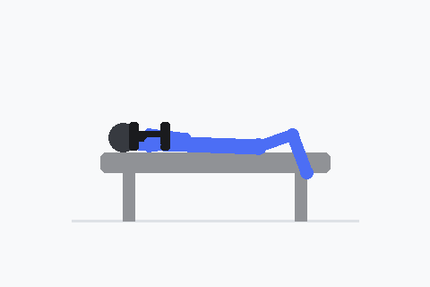

# FitLog Pro

**AI-Powered Personal Training Management Platform**

FitLog Pro revolutionizes the personal training industry with a unified mobile application serving both trainers and clients. Built with Flutter and Supabase, it features AI-powered workout generation, zero-typing session logging, and comprehensive lifestyle tracking.

## 🎞 Exercise Demo

Dumbbell bench press, rendered entirely in Flutter via `CustomPainter`:



The preview above is generated by `scripts/generate_exercise_gif.py`, which mirrors the geometry used by `DumbbellBenchPressPainter` in the app so the README stays visually in sync with the live widget.

---

## 📋 Table of Contents

- [Overview](#overview)
- [Features](#features)
- [Technology Stack](#technology-stack)
- [Prerequisites](#prerequisites)
- [Installation](#installation)
- [Project Structure](#project-structure)
- [Development](#development)
- [Testing](#testing)
- [Documentation](#documentation)
- [Contributing](#contributing)

---

## 🎯 Overview

### Vision

Empower personal trainers with AI-first tools to deliver exceptional client experiences while minimizing administrative burden. Enable clients to seamlessly track lifestyle habits and progress through an intuitive mobile interface.

### Key Principles

- **Zero-Typing Interface**: Log complete sessions in <60 seconds
- **AI-First Design**: LLM-powered summaries and workout generation
- **Offline-First**: Core features work without connectivity (gym environments)
- **Single App Architecture**: Role-based UI for trainers and clients

---

## ✨ Features

### For Trainers

- **Client Management**: Complete client profiles with progress tracking
- **Session Logging**: Voice-powered, tap-based session recording
- **AI Workout Generation**: Intelligent exercise recommendations
- **FitLog Academy**: Tiered certification system
- **Dashboard & Analytics**: Client progress visualization

### For Clients (FitLog Life)

- **Lifestyle Tracking**: Meals, water, sleep, activity, mood logging
- **Body Photos**: Progress documentation
- **Session History**: Access to all training sessions
- **Today Dashboard**: At-a-glance daily overview

---

## 🛠 Technology Stack

### Frontend
- **Flutter** 3.16+ with Dart 3.2+
- **Riverpod** for state management
- **Go Router** for navigation
- **Material Design 3**

### Backend
- **Supabase** (PostgreSQL + Edge Functions)
- **Row-Level Security** (RLS)
- **Supabase Storage** for media
- **Real-time subscriptions**

### Local Storage
- **Drift** (SQLite) for offline-first
- **shared_preferences**

---

## 📦 Prerequisites

- **Flutter SDK**: 3.16+
  ```bash
  flutter --version
  ```
- **Dart SDK**: 3.2+ (included with Flutter)
- **Android Studio** or **Xcode**
- **VS Code** or **IntelliJ IDEA**

---

## 🚀 Installation

### 1. Clone & Install

```bash
git clone https://github.com/your-org/fitlog-pro.git
cd FitLog_Pro_app
flutter pub get
```

### 2. Generate Code

```bash
flutter pub run build_runner build --delete-conflicting-outputs
```

### 3. Configure Environment

Create `.env` file:
```env
SUPABASE_URL=your_supabase_url
SUPABASE_ANON_KEY=your_anon_key
```

### 4. Run

```bash
flutter run
```

---

## 📂 Project Structure

```
lib/
├── core/              # Theme, config, constants, utils
├── features/          # Feature modules (Clean Architecture)
│   ├── auth/
│   ├── trainer_home/
│   ├── client_management/
│   ├── active_session/
│   ├── fitlog_life/
│   ├── academy/
│   └── ai_exercise/
├── shared/            # Reusable widgets, models, services
├── navigation/        # Go Router configuration
└── providers/         # Global Riverpod providers
```

---

## 🔧 Development

### Code Quality

```bash
flutter analyze          # Run linter
flutter test            # Run tests
flutter test --coverage # Generate coverage
```

### Code Generation

```bash
# One-time generation
flutter pub run build_runner build --delete-conflicting-outputs

# Watch mode (during development)
flutter pub run build_runner watch
```

---

## 🧪 Testing

```bash
# All tests
flutter test

# Specific test
flutter test test/unit/features/auth/

# Coverage
flutter test --coverage
genhtml coverage/lcov.info -o coverage/html
open coverage/html/index.html
```

Test structure:
- `test/unit/` - Business logic
- `test/widget/` - UI components
- `test/integration/` - E2E flows

---

## 📚 Documentation

Comprehensive docs in `docs/`:

- **[PRD](docs/product/PRD.md)** - Product Requirements
- **[TSD](docs/technical/TSD.md)** - Technical Specifications
- **[TSD-Flutter](docs/technical/TSD-Flutter.md)** - Flutter Implementation Guide
- **[UXUI-Flutter](docs/design/UXUI-Flutter.md)** - Widget Specifications

---

## 🤝 Contributing

See [CONTRIBUTING.md](CONTRIBUTING.md) for guidelines on:
- Code style and conventions
- Feature module structure
- Testing requirements
- Git workflow

### Quick Start

1. Fork the repository
2. Create feature branch: `git checkout -b feature/name`
3. Make changes
4. Run tests: `flutter test`
5. Run linter: `flutter analyze`
6. Commit: `git commit -m 'Add feature'`
7. Push and create Pull Request

---

## 🏗 Architecture

**Clean Architecture** with three layers:
- **Presentation**: UI (screens, widgets, state)
- **Domain**: Business logic (entities, use cases)
- **Data**: Data sources (API, database, repositories)

**State Management**: Riverpod with compile-safe providers

**Offline-First**: Drift (SQLite) + Supabase sync

---

## 🗺 Roadmap

- **Phase 0** (Week 1-2): Foundation - ✅ In Progress
- **Phase 1** (Week 3-8): MVP Core
- **Phase 2** (Week 9-14): Enhancement
- **Phase 3** (Week 15-18): Scale & Deploy

---

## 📱 Supported Platforms

- ✅ Android (API 21+)
- ✅ iOS (iOS 12+)
- ⏳ Web (Future)

---

## 📄 License

Proprietary software. All rights reserved.
Copyright © 2024 FitLog Pro.

---

**Built with ❤️ using Flutter & Supabase**
