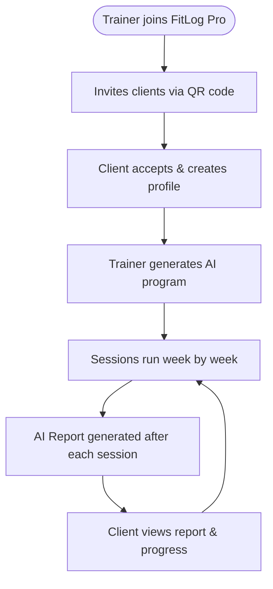
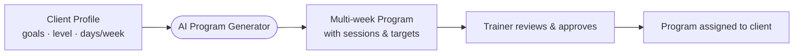
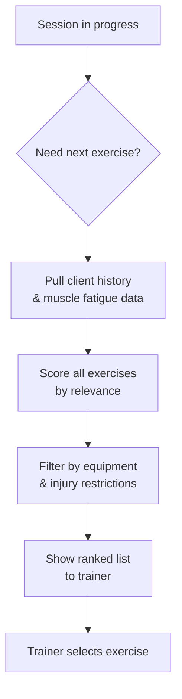
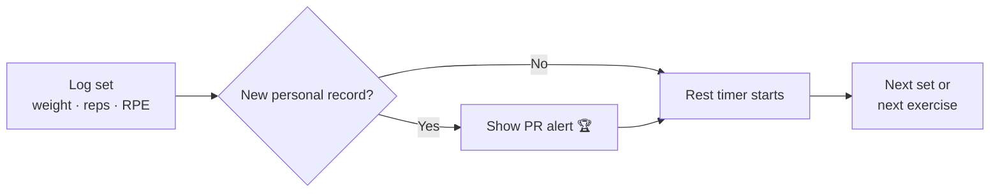
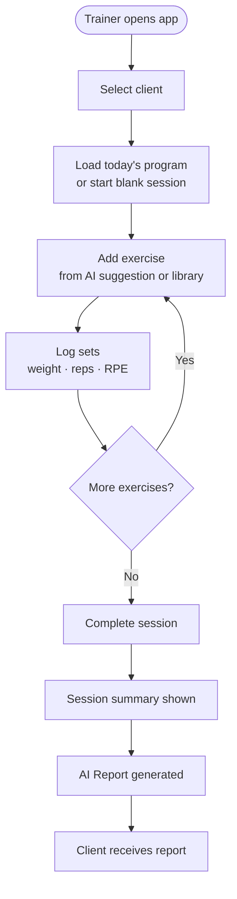

# FitLog Pro — AI Trainer Recording Solution

**Date**: 2026-03-31

---

## What is FitLog Pro?

FitLog Pro is a mobile app for personal trainers and their clients. It handles the full workflow of a training relationship — from program creation to in-session recording to post-workout analysis — with an AI layer that removes the guesswork from program design and exercise selection.

The trainer runs the session. The AI handles the prep work.

---

## Who It's For

| Role | What they get |
|------|--------------|
| **Trainer** | Smart program generation, live session recording, client management, and AI-written session reports |
| **Client** | A clear view of every session, progress over time, body tracking, and lifestyle logging |

---

## How It Works — The Big Picture

---

## Core Features

### AI Program Generation
Trainers input a client's goals, fitness level, and available training days. The app generates a full multi-week program — split structure, exercise selection, set/rep targets, and progression scheme — ready to use immediately.

### Smart Exercise Recommendations
During a session, the app suggests the most appropriate next exercises based on:
- What's already been done in the session (muscle balance)
- The client's recent training history (fatigue and recovery)
- The client's available equipment and any injury restrictions
- The client's stated goals

### Live Session Recording
Each set is logged with weight, reps, and effort level (RPE). The app automatically detects personal records and highlights them in real time. A rest timer starts after every set. Trainers can add notes per exercise or per set.

### Post-Session AI Report
After a session is completed, the app generates a written analysis covering:
- Volume and intensity summary
- Muscle group balance
- PR highlights
- Recovery suggestions
- Progress toward the client's goals

Reports are visible to the client directly in the app.

### Lifestyle Tracking
Clients log daily sleep, meals, water intake, and mood. This data feeds into training context so the trainer always has a full picture of recovery and readiness.

### Muscle Map
An interactive body diagram shows which muscle groups have been trained recently, using a heatmap. This helps trainers avoid overuse and plan recovery days visually.

### Calendar & Scheduling
Trainers schedule sessions for clients, manage session packages, and view their full weekly calendar at a glance.

---

## A Session From Start to Finish

---

## Exercise Library

The app includes 236 exercises covering strength, cardio, mobility, and bodyweight training. Every exercise is categorized by movement pattern, muscle group, equipment, and difficulty. Trainers can add custom exercises scoped to their own account.

---

## Tech at a Glance

- Mobile: iOS and Android (Flutter)
- Backend: Supabase (cloud database, authentication, storage)
- AI: Edge function-powered program generation + on-device recommendation scoring
- Data security: Row-level security — trainers only see their own clients, clients only see their own data
- Language support: Korean (primary)

---

## What Makes It Different

Most training apps are either logging tools (record what you did) or program builders (plan what to do). FitLog Pro connects both ends with an AI layer that continuously learns from session data and improves its recommendations over time. The trainer stays in control. The AI reduces the prep work and surfaces insights that would otherwise require manual review.

---

*FitLog Pro is built by Havbit.*
