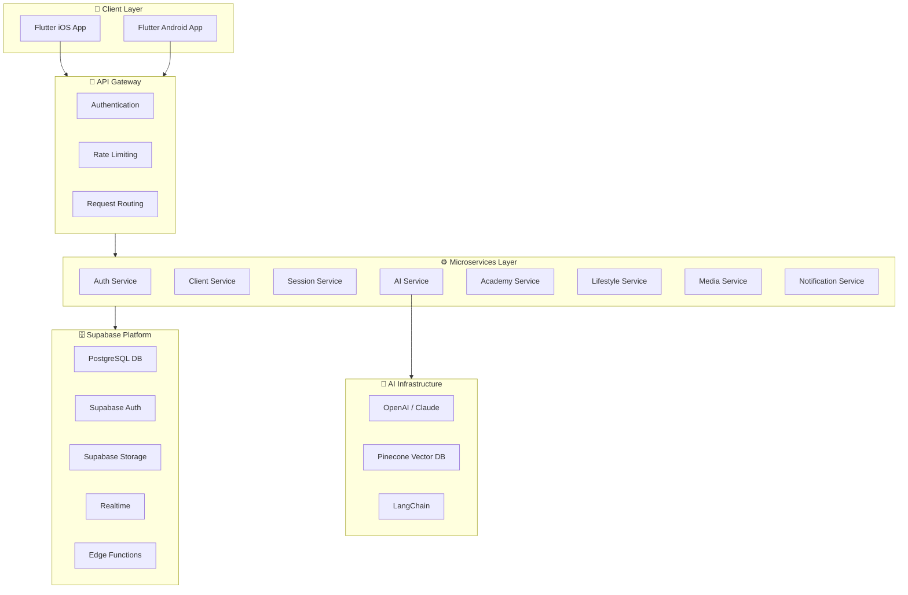
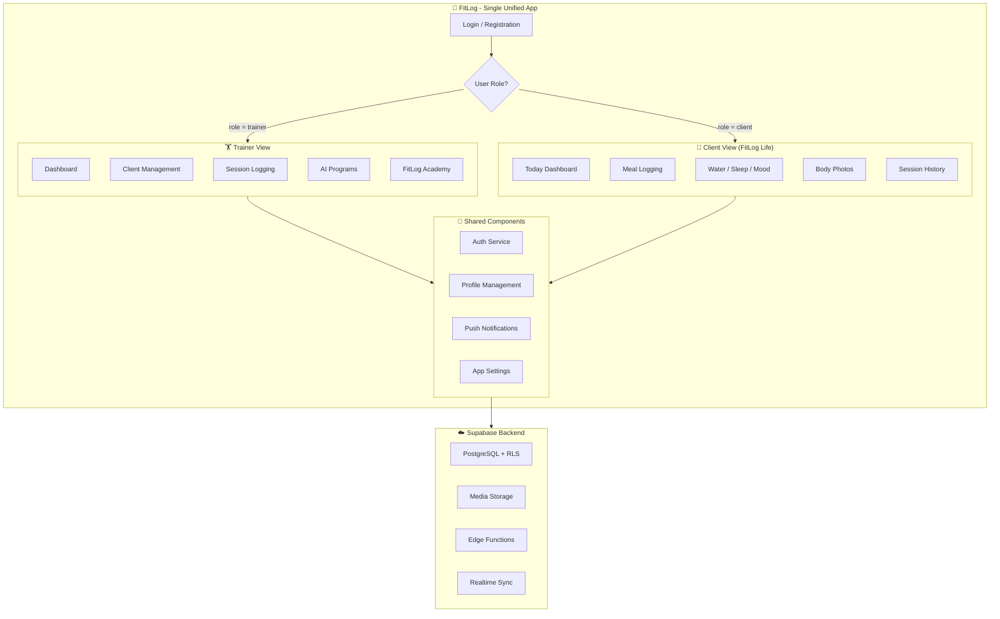
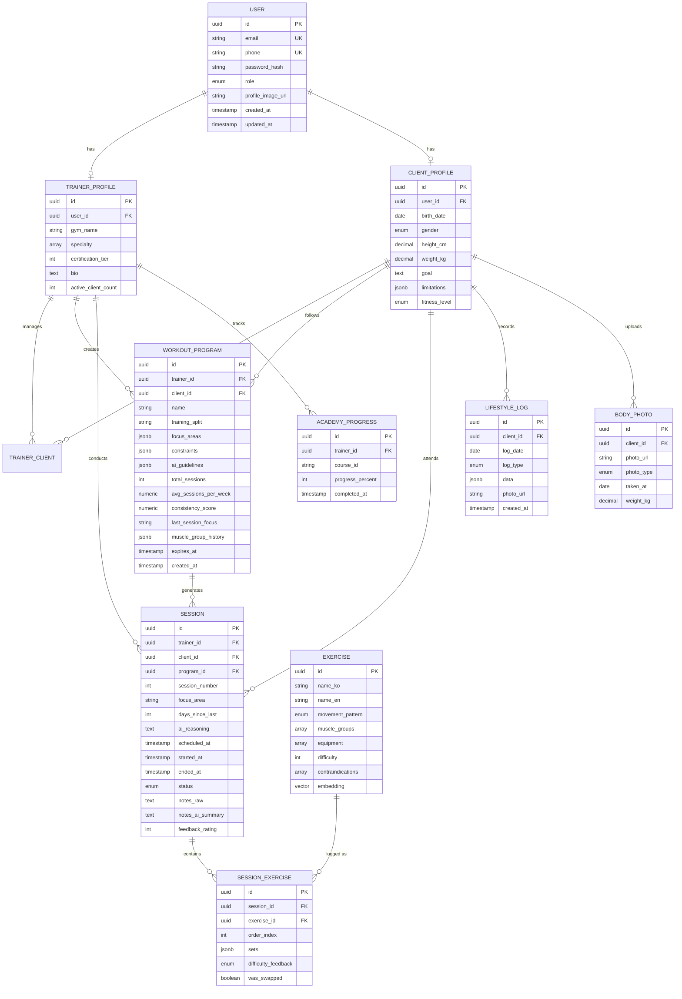
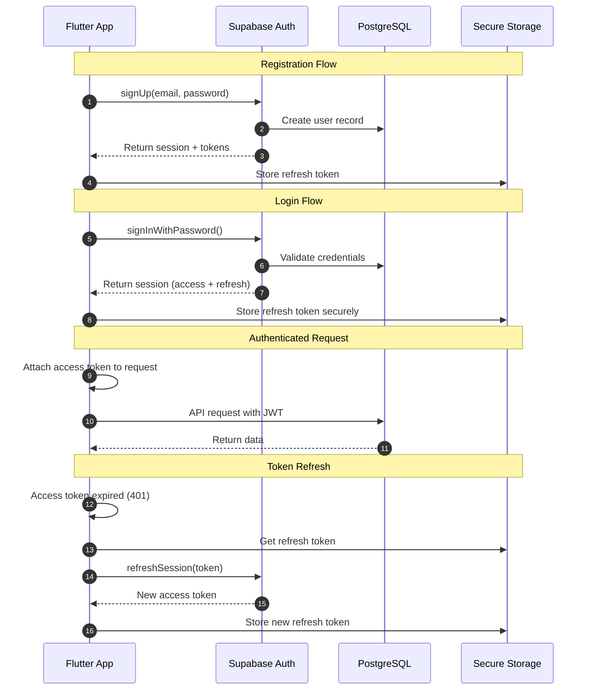
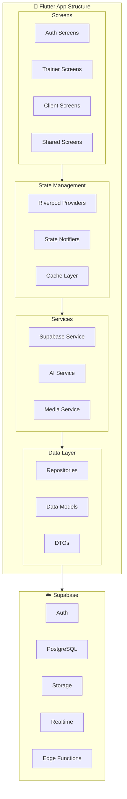

# FitLog - Technical Specification Document

**Version:** 1.2
**Last Updated:** December 2024
**Status:** Draft
**MVP Target:** Q1 2026

---

## Document Information

| Item | Details |
|------|---------|
| Document Title | FitLog Technical Specification Document |
| Version | 1.2 |
| Last Updated | December 2024 |
| Related Documents | FitLog Pro PRD v1.2 |
| Technology Stack | Flutter + Supabase |

---

## Table of Contents

1. [Introduction](#1-introduction)
2. [System Architecture](#2-system-architecture)
3. [Data Models](#3-data-models)
4. [API Specifications](#4-api-specifications)
5. [Authentication & Authorization](#5-authentication--authorization)
6. [AI/ML Components](#6-aiml-components)
7. [Frontend Architecture](#7-frontend-architecture)
8. [Security Requirements](#8-security-requirements)
9. [Performance Requirements](#9-performance-requirements)
10. [Deployment Strategy](#10-deployment-strategy)
11. [Testing Strategy](#11-testing-strategy)
12. [Monitoring & Observability](#12-monitoring--observability)
13. [Appendix](#13-appendix)

---

## 1. Introduction

### 1.1 Purpose

This Technical Specification Document (TSD) provides a comprehensive technical blueprint for building FitLog Pro and FitLog Life. It serves as the primary reference for development teams, covering system architecture, data models, API specifications, security requirements, and deployment strategies.

### 1.2 Scope

This document covers the technical implementation of a **single unified application** with role-based UI:

- **Trainer View:** Client management, session logging, AI workout generation, FitLog Academy
- **Client View (FitLog Life):** Lifestyle tracking (meals, water, sleep, activity, mood), body photos
- **Shared Infrastructure:** Authentication, AI/ML services, and data platform

### 1.3 System Overview

FitLog is a unified mobile application with role-based views serving two distinct user types:

- **Trainers:** Access client management, session logging, AI workout generation, and FitLog Academy
- **Clients:** Access lifestyle tracking (meals, water, sleep, activity, mood) and body photo uploads

**Key Technical Decisions:**

- **Single App Architecture:** One codebase with role-based UI switching
- **Zero-Typing Interface:** Voice input, quick-tap interactions, minimal keyboard usage
- **AI-First Design:** LLM-powered summaries, recommendations, and workout generation
- **Offline-First:** Core features work without connectivity
- **Flutter + Supabase:** Cross-platform mobile with integrated backend services

---

## 2. System Architecture

### 2.1 High-Level Architecture

The system follows a client-server architecture leveraging Supabase's integrated platform.



[🎨 Edit Architecture Diagram](https://mermaidchart.com/play?utm_source=mermaid_mcp_server&utm_medium=remote_server&utm_campaign=claude#pako:eNqNlMGO0zAQhl_F6l5Zsd1WbbcHpLR0q0jpbmnKIkQ5eJ1xa5HaxXF2VSFu3EECgeDChRfgxvPwAvAI2LET6m4qyMUzns-TyT8Tv2oQkUCj36CpuCUrLBWaDxYc6SfLr5cSb1ZoGIWji_mzReP31_ff0TBlwBWK8BbkovHcsuZhl7FmztNcKZDGQ8Fm4xEBT6RgyQ7ldjwSeGKNvTLGwXz0JHha1PHhHQqmIRpjBbd4678kVyvNmEXXyQhWTHCPmOlTmjALitiaKcaXPiByS8DLHDJV-LvMoQrj0ewqHI6MDD-_fP714y2aMCJFBvKGEchqNEuYBGIKRNHM_4T4hrivQLE97x20XbCQ60gdFkOW6eyWc04tGITuhWF9mOAE1lvHWKcWjBjVim1TsGjl1sITSBi2YGHWQhdCMWqhwnQdvcMebMrjaTAI4lExN5_emK7E-QZf4wzQNMWKCrn-j55MxzrBVGRqKSF-FKGHA19ondJNXpXd-D6khMRL2GXclj9-gFPF1nYCrenFR0mRwyzoPOdFrdk_dQjCQoFvH7WFQk4lzpTMicrlXgejiQYvN8A1d18PGs4Tn7jS8ghp5GAciODgdvY1iTBfDleYcTMIpX2oTnNfHB8_KP9yu1leD3cCzikC5V9nI6VnQ673LpuZ8WI_CD2JigG1txyiLE37R3BCTync0wqJF9A_OjnttUl3ly4LsDgF2iLdCk_Out2Tzi5eVWX5hFACf_lmB7fa2ONd4WX-FvQorfizVqsFHq9b5UgKbehUJDSbSbvXeP0Hy5nVbQ)

### 2.1.1 Unified App Architecture

FitLog is a **single application** with role-based UI switching. After login, the app routes users to different views based on their role.



[🎨 Edit Unified App Diagram](https://mermaidchart.com/play?utm_source=mermaid_mcp_server&utm_medium=remote_server&utm_campaign=claude#pako:eNqVVcFu00AQ_ZWRuYCgakvatFQC5LipGpFGwU7hQFC0sWedVR2vZW-oorYHzhwqARLcuHPjxvfwA_AJzNqOYzduKHvZ2d33xpn3ZjcXhis9NA4MHshzd8JiBYPWMAQayWzsxyyagNnvvxkaf759-gFHQnWlDxvgiNAPEE5DwQV6YEbR0Hib8fTwRIyuEjIssumxjCiJCClpOsMm2OiLRMVMUyqJblBgY-MZ2DJAa4Lu2cXQOE0wTjeeD42rOlpRxcA2O722PTrtpMVcf_j98xoGMRMhZXgl8Lzy3duL0GMwOmTJZCxZ7FGyIl7JMBhZgcBQJYTKIjhhIfNxSmEN2sEkoe9peB7qsqluvwbcjyVVNtVgswOLVQ3QdJmH0znhcvvyjQoUQ2-tfFa30-4NFup9_A55PVo5uJ8n7gqOD_5DR6ui40B6bA63q2mNTpAFul4936qMNSJX3TM6IuRrpsjeTXACxIjmEynrEvcnUkmduSW9OWSrGtgxNamM5yV78p27SFm0rW7iy6ER0xqegspacGhcllr0nyw3VV-TCmPW2uccm3b7MPXu8xdw6KLTrbXkNJKh7s81nnXt6ok5UxPdcjSBg_E74eIKm5qRiwAJlkfr2r4nFT0ibnr3tQX9WTKpbq5QHFSK_E1bP4qK5V1cWGqcviWZLsvjQs2V0yLfjdexZVov2j0t7a-v7_Wb4swiNmYJQou6ULPqH8ayroctXbdMlB-j87ILD8HuOhWeQ11GAqa97wm2WFcwbS8F6AmOZqG7qp1N90aJqUYtQnDmoVuAbhSZ1Z9KkZdZkUDNyVn6dwCyODi4x7e4x3ce0Tsuz_Dg3naTNXZYGVrSPmN4Y2QcC0ZjvP-YN8uMpR35J5A33L2CwHef4Na4TMh_cY5u4D7nBZrt7-7yvTI6LyqH4xbuleDNRrPJt42rv_jUHcg)

### 2.2 Technology Stack

#### 2.2.1 Frontend (Mobile)

| Component | Technology | Justification |
|-----------|------------|---------------|
| Framework | **Flutter 3.x** | Cross-platform, native performance, hot reload |
| Language | **Dart** | Strong typing, async/await, null safety |
| State Management | **Riverpod** | Compile-safe, testable, scalable |
| Navigation | **go_router** | Declarative routing, deep linking |
| Local Storage | **Drift (SQLite)** | Offline-first, type-safe queries |
| HTTP Client | **Dio** | Interceptors, retry logic |
| Voice Input | **speech_to_text** | Cross-platform voice recognition |

#### 2.2.2 Backend (Supabase)

| Component | Technology | Justification |
|-----------|------------|---------------|
| Database | **PostgreSQL 15** | ACID compliance, JSONB, extensions |
| Authentication | **Supabase Auth** | OAuth, magic links, row-level security |
| Storage | **Supabase Storage** | S3-compatible, CDN, transformations |
| Realtime | **Supabase Realtime** | WebSocket subscriptions, presence |
| Edge Functions | **Deno** | Serverless, TypeScript, low latency |
| Vector Search | **pgvector** | Native PostgreSQL vector similarity |

#### 2.2.3 AI/ML Infrastructure

| Component | Technology | Purpose |
|-----------|------------|---------|
| LLM Provider | **OpenAI GPT-4 / Claude** | Session summaries, recommendations |
| Embedding Model | **OpenAI Ada-002** | Exercise similarity matching |
| Vector Database | **pgvector** | Semantic search in PostgreSQL |
| Orchestration | **LangChain** | LLM workflow management |

---

## 3. Data Models

### 3.1 Entity Relationship Diagram



[🎨 Edit ERD Diagram](https://mermaidchart.com/play?utm_source=mermaid_mcp_server&utm_medium=remote_server&utm_campaign=claude#pako:eNqlVdtuGjEQ_RWL9_xA3tKwSVFpiIBIjZrKMvawuKztrS-QKOTfO14uu2uWglKEYOWZ451z5vbe40ZA77oHti9Zbpl60QQ_T5NsTDabqyuzIdPxzeAhG9PH8ehuMMzINXnpLZh76R273g4H2cP0lGd6UQV6PxxvwRVIMc1yOACTa0_jmHMy1yCIN2deOskmk8HooUJxo0Xg_szrmgjmPWhxAOxNO8_sRza-HUwyOhzd71_gmdQH_73DSUBh8hxZsDMhDQd32WT6PKyBFrix4gzsy6j_TB-_jqajChPKwjBxLks3tzf97PtzPL4fI98K6i3jywOyUQ_v2-f4CUEKgt_Hb_WZ81bqnIBisiBPx4ZyYTR0GjDDa2RIsawWtRV0UMSaArYxSQ2WbAgvJGi_j655izVzWQCVCquMBlvUHl4qcJ6pknALzIOgzHdZQyla1o-mBKmEZ9SozoIDS_H_7ph0_qaoZgpSw89fxJXAJSv8W22T2hMO1su55MxLo6mXYBsc4NWTmTRtBONeroBuJaPcBN1FLKmnz_KK0mEI1i9ofEzymGNrNQMWSFGxgixA5guMTR2b1lvTMk9o5oY1cvvbGT0jhVTSV8K45MVz6TU4RwtYQdHBft_ml9DeVWHKvLLtRE5MdW05vgARipO1h7_2dGVG9dq2ihwafXCJPtp4cNSydec5k9QFpZhNqmsOIGbY-Aj0WIYdSrUG2iVyOdQ9lmqXXPAKlksHqTGGgqMgioyUX9M8O_BpgoWcY1MEbBe651B7zAzOD6bJmjnq1qwsQfyD2YUTLrYtXZruc9BJfMqsQMXSKOOCsbqj4VVwHCdXbk0oXYcd_gRZxjvaOtXMOzBxPcVyFbuB0bh3Bdwbi4N6BkJ057q9hC5Jdnf9V0MBF1_XSIjH_q2ENMfoyrqWhzeXTvUWlcZi_DyP01FUVLbnbTIVdc-WoFt9e2K6tUI-Wsv_MZx2kePwt1W3tUsIl2Zu43gssR1bBdZQ16iygJa-vY-_UqAglw)

### 3.2 Core Entities

#### 3.2.1 User (Base)

| Field | Type | Constraints | Description |
|-------|------|-------------|-------------|
| id | UUID | PK | Unique identifier (Supabase auth.users) |
| email | VARCHAR(255) | UNIQUE, NOT NULL | Login email |
| phone | VARCHAR(20) | UNIQUE | Phone number |
| role | ENUM | NOT NULL | 'trainer' \| 'client' |
| profile_image_url | TEXT | NULLABLE | Supabase Storage URL |
| created_at | TIMESTAMPTZ | DEFAULT NOW() | Creation time |
| updated_at | TIMESTAMPTZ | AUTO UPDATE | Last update |

#### 3.2.2 Trainer Profile

| Field | Type | Constraints | Description |
|-------|------|-------------|-------------|
| id | UUID | PK, FK→auth.users | Links to Supabase auth |
| gym_name | VARCHAR(100) | NULLABLE | Affiliated gym |
| specialty | TEXT[] | NULLABLE | Training specialties |
| certification_tier | SMALLINT | DEFAULT 0 | Academy tier (0-3) |
| bio | TEXT | NULLABLE | Profile description |
| active_client_count | INTEGER | DEFAULT 0 | Billing metric |

#### 3.2.3 Client Profile

| Field | Type | Constraints | Description |
|-------|------|-------------|-------------|
| id | UUID | PK, FK→auth.users | Links to Supabase auth |
| birth_date | DATE | NOT NULL | For age calculation |
| gender | VARCHAR(10) | NULLABLE | 'M' \| 'F' \| 'Other' |
| height_cm | DECIMAL(5,2) | NULLABLE | Height in cm |
| weight_kg | DECIMAL(5,2) | NULLABLE | Current weight |
| goal | TEXT | NULLABLE | Fitness goal |
| limitations | JSONB | DEFAULT '[]' | Physical limitations |
| fitness_level | VARCHAR(20) | DEFAULT 'beginner' | Experience level |

#### 3.2.4 Workout Program (Training Direction)

The workout program represents a training **direction** rather than a detailed workout plan. Instead of pre-defining specific exercises for each day, the program provides guidance that the AI uses to dynamically generate appropriate exercises for each session.

**Key Concept:** Programs are training strategies, not workout blueprints. The AI generates exercises per session based on:
- Gap since last session (recovery time)
- Client's workout frequency and consistency patterns
- Recent muscle groups worked
- Program's training split preference

| Field | Type | Constraints | Description |
|-------|------|-------------|-------------|
| id | UUID | PK, DEFAULT gen_random_uuid() | Program identifier |
| trainer_id | UUID | FK→trainer_profiles | Program creator |
| client_id | UUID | FK→client_profiles | Program owner |
| name | VARCHAR(100) | NOT NULL | Program name |
| training_split | VARCHAR(20) | DEFAULT 'full_body' | Split type: full_body, upper_lower, push_pull_legs, bro_split, custom |
| focus_areas | JSONB | DEFAULT '[]' | Priority muscle groups or goals: ["chest", "back", "strength"] |
| constraints | JSONB | DEFAULT '{}' | Client limitations: {"avoid_exercises": [], "max_duration_minutes": 60} |
| ai_guidelines | JSONB | DEFAULT '{}' | AI memory: learned preferences, adjustments, notes |
| total_sessions | INTEGER | DEFAULT 0 | Count of completed sessions in this program |
| avg_sessions_per_week | NUMERIC(3,1) | DEFAULT 0 | Rolling average sessions per week |
| consistency_score | NUMERIC(3,2) | DEFAULT 0 | Client consistency rating 0-1 |
| last_session_focus | VARCHAR(50) | NULLABLE | Focus area of most recent session |
| muscle_group_history | JSONB | DEFAULT '[]' | Recent muscle groups worked with dates |
| expires_at | TIMESTAMPTZ | NULLABLE | Program expiration (default 3 months) |
| created_at | TIMESTAMPTZ | DEFAULT NOW() | Creation time |

**Training Split Options:**
- `full_body`: All major muscle groups each session (for 2-3x/week frequency)
- `upper_lower`: Alternating upper/lower body (for 4x/week frequency)
- `push_pull_legs`: Push/Pull/Legs rotation (for 3-6x/week frequency)
- `bro_split`: Single muscle group focus per day (for 5-6x/week frequency)
- `custom`: Trainer-defined custom split

**AI Guidelines Schema:**
```json
{
  "preferred_exercises": ["barbell_squat", "deadlift"],
  "avoided_exercises": ["leg_press"],
  "intensity_preference": "high",
  "rest_time_seconds": 90,
  "notes": ["Client prefers compound movements", "Shoulder injury - avoid overhead"]
}
```

#### 3.2.5 Training Session

| Field | Type | Constraints | Description |
|-------|------|-------------|-------------|
| id | UUID | PK, DEFAULT gen_random_uuid() | Session identifier |
| trainer_id | UUID | FK→trainer_profiles | Session trainer |
| client_id | UUID | FK→client_profiles | Session client |
| program_id | UUID | FK→workout_programs | Parent program |
| session_number | INTEGER | NULLABLE | Sequential number within program |
| focus_area | VARCHAR(50) | NULLABLE | Primary focus (chest, pull, legs, etc.) |
| days_since_last | INTEGER | NULLABLE | Days gap from previous session |
| ai_reasoning | TEXT | NULLABLE | AI explanation for exercise selection |
| scheduled_at | TIMESTAMPTZ | NOT NULL | Scheduled time |
| started_at | TIMESTAMPTZ | NULLABLE | Actual start |
| ended_at | TIMESTAMPTZ | NULLABLE | Actual end |
| status | VARCHAR(20) | DEFAULT 'scheduled' | Session status |
| notes_raw | TEXT | NULLABLE | Raw trainer notes |
| notes_ai_summary | TEXT | NULLABLE | AI-generated summary |
| feedback_rating | SMALLINT | CHECK (1-5) | Client rating |

**AI Session Generation Logic:**

When generating a session, the AI considers:

1. **Gap Analysis:** `days_since_last` determines recovery level
   - 1-2 days: Light/recovery session or different muscle group
   - 3-4 days: Normal intensity, smart split selection
   - 5+ days: Full body or priority muscle groups

2. **Split Determination:** Based on `training_split` and `muscle_group_history`
   - For `push_pull_legs`: Check last focus, rotate to next in sequence
   - For `upper_lower`: Alternate between upper and lower
   - For `full_body`: Prioritize muscles not worked recently

3. **Consistency Adaptation:** Based on `avg_sessions_per_week` and `consistency_score`
   - Low consistency (< 2x/week): Prefer full body to maximize each session
   - High consistency (4x+/week): Follow split strictly

#### 3.2.6 Session Exercise

| Field | Type | Constraints | Description |
|-------|------|-------------|-------------|
| id | UUID | PK | Log identifier |
| session_id | UUID | FK→sessions | Parent session |
| exercise_id | UUID | FK→exercises | Exercise reference |
| order_index | SMALLINT | NOT NULL | Exercise order |
| sets | JSONB | NOT NULL | Array of set data |
| difficulty_feedback | VARCHAR(10) | NULLABLE | 'easy' \| 'good' \| 'hard' |
| was_swapped | BOOLEAN | DEFAULT false | AI swap used |
| original_exercise_id | UUID | NULLABLE | If swapped, original |

**Sets JSONB Schema:**
```json
[
  {
    "set_number": 1,
    "weight": 60.0,
    "reps": 10,
    "rpe": 7,
    "is_warmup": false,
    "is_pr": false,
    "tags": ["focused", "good_form"]
  }
]
```

#### 3.2.7 Lifestyle Log (FitLog Life)

| Field | Type | Constraints | Description |
|-------|------|-------------|-------------|
| id | UUID | PK | Log identifier |
| client_id | UUID | FK→client_profiles | Owner |
| log_date | DATE | NOT NULL | Log date |
| log_type | VARCHAR(20) | NOT NULL | meal \| water \| sleep \| activity \| mood |
| data | JSONB | NOT NULL | Type-specific data |
| photo_url | TEXT | NULLABLE | Supabase Storage URL |
| created_at | TIMESTAMPTZ | DEFAULT NOW() | Creation time |

**Lifestyle Log Data Schema by Type:**

- **Meal:** `{ mealType: 'breakfast'|'lunch'|'dinner'|'snack', description: string, photoUrl?: string }`
- **Water:** `{ amount_ml: number, timestamp: string }`
- **Sleep:** `{ bedTime: string, wakeTime: string, quality: 1-5 }`
- **Activity:** `{ type: string, duration_min: number, intensity: 'low'|'medium'|'high' }`
- **Mood:** `{ score: 1-5, note?: string }`

#### 3.2.8 Exercise Library

| Field | Type | Constraints | Description |
|-------|------|-------------|-------------|
| id | UUID | PK | Exercise ID |
| name_ko | VARCHAR(100) | NOT NULL | Korean name |
| name_en | VARCHAR(100) | NOT NULL | English name |
| movement_pattern | VARCHAR(20) | NOT NULL | squat\|hinge\|push\|pull\|carry\|rotation |
| muscle_groups | TEXT[] | NOT NULL | Target muscles |
| equipment | TEXT[] | DEFAULT '{}' | Required equipment |
| difficulty | SMALLINT | CHECK (1-5) | Skill requirement |
| contraindications | TEXT[] | DEFAULT '{}' | When to avoid |
| video_url | TEXT | NULLABLE | Demo video URL |
| embedding | VECTOR(1536) | NOT NULL | Semantic embedding (pgvector) |

---

## 4. API Specifications

### 4.1 API Architecture

FitLog uses Supabase's built-in APIs plus custom Edge Functions:

- **Supabase Client:** Direct database access with RLS policies
- **Edge Functions:** Complex business logic, AI integrations
- **Realtime:** WebSocket subscriptions for live updates

### 4.2 Supabase Client Usage (Flutter)

```dart
// Initialize Supabase
final supabase = Supabase.instance.client;

// Authentication
await supabase.auth.signUp(email: email, password: password);
await supabase.auth.signInWithPassword(email: email, password: password);

// Database queries with RLS
final sessions = await supabase
    .from('sessions')
    .select('*, client:client_profiles(*), exercises:exercise_logs(*)')
    .eq('trainer_id', trainerId)
    .gte('scheduled_at', DateTime.now().toIso8601String())
    .order('scheduled_at');

// Realtime subscriptions
supabase
    .from('sessions')
    .stream(primaryKey: ['id'])
    .eq('trainer_id', trainerId)
    .listen((data) => updateUI(data));

// Storage upload
await supabase.storage
    .from('body-photos')
    .upload('$userId/$filename', file);
```

### 4.3 Edge Functions

#### 4.3.1 generate-session

Generate a personalized session dynamically using AI. This is the primary workout generation endpoint that creates exercises based on the client's program direction, recent history, and current state.

**Endpoint:** `POST /functions/v1/generate-session`

| Parameter | Type | Required | Description |
|-----------|------|----------|-------------|
| clientId | UUID | Yes | Target client |
| programId | UUID | Yes | Associated program (training direction) |
| trainerId | UUID | Yes | Session trainer |

**Response:**
```json
{
  "session_id": "uuid",
  "focus_area": "push",
  "days_since_last": 3,
  "ai_reasoning": "Based on your 3-day gap and recent leg focus, today is a push day focusing on chest and shoulders.",
  "exercises": [
    {
      "exercise_id": "uuid",
      "name": "Barbell Bench Press",
      "target_sets": 4,
      "target_reps": "8-10",
      "target_weight": 60.0,
      "rest_seconds": 90
    }
  ]
}
```

**AI Decision Factors:**
1. `days_since_last`: Gap since last session (recovery consideration)
2. `muscle_group_history`: Recent muscle groups worked
3. `training_split`: Program's preferred split pattern
4. `consistency_score`: Client's training consistency
5. `ai_guidelines`: Trainer's custom preferences stored in program

#### 4.3.2 create-program

Create a new training program (direction) for a client.

**Endpoint:** `POST /functions/v1/create-program`

| Parameter | Type | Required | Description |
|-----------|------|----------|-------------|
| clientId | UUID | Yes | Target client |
| trainerId | UUID | Yes | Program creator |
| name | string | Yes | Program name |
| training_split | string | No | Split type (default: 'full_body') |
| focus_areas | string[] | No | Priority muscle groups |
| constraints | object | No | Client limitations |
| duration_months | integer | No | Program duration (default: 3) |

#### 4.3.3 swap-exercise

Get alternative exercises with AI reasoning.

**Endpoint:** `POST /functions/v1/swap-exercise`

| Parameter | Type | Required | Description |
|-----------|------|----------|-------------|
| exerciseId | UUID | Yes | Exercise to swap |
| reason | string | No | Why swapping |
| clientId | UUID | Yes | For personalization |
| preservePattern | boolean | No | Keep movement pattern (default: true) |

#### 4.3.4 session-summary

Generate AI summary of training session.

**Endpoint:** `POST /functions/v1/session-summary`

| Parameter | Type | Required | Description |
|-----------|------|----------|-------------|
| sessionId | UUID | Yes | Completed session |
| includeRecommendations | boolean | No | Add next session suggestions |
| language | string | No | 'ko' \| 'en' (default: 'ko') |

---

## 5. Authentication & Authorization

### 5.1 Authentication Flow (Supabase Auth)



[🎨 Edit Auth Flow Diagram](https://mermaidchart.com/play?utm_source=mermaid_mcp_server&utm_medium=remote_server&utm_campaign=claude#pako:eNqNkkFPAjEQhf9Kw2mJmGjiiQMJSDQYQhBQL16G7rg0Lm1tp6Ix_nen2zUBdxX3sOlsv-17b6YfHWly7PQ7Hl8CaoljBYWD7aMW_EAgo8N2jS7VFhwpqSxoEkNrBXhxVQYidLFsYQJtIrQMFtbgsfrQxMajCM2Np8Lh8nbaJJZkHFYnoQy8ijUUmMD0nhlCYV6TlV71Q18ssFCeHJAymq2aXWKZOB0Mopm-8KrQdzbDLaiyx6Le74zLuzXICJPjUV9cOgRWCJ4VHEpm9pB4mrVRj4LTwqP3UfFEkHlG7fdVa2cpkcMnh36TsKNppqZQf8WY6AdFm3kdIWtmuIdS5TGFdJijJgWlP54iAyl5yWlqu93_5eED4rDK96PBonq0I9lbzvJ8FT0dZIy2hkQg-T4lN0mCDGs28Jh1OJ98b4kdt0XcPKwSMx79TMo9gaMmV5XgIiVsmtt3hW9WcYdFdnF23tasa6S20e_Ps95ephlkFdVtmdUMdwcd-XU0msEDzc7nF90aUr0)

### 5.2 Token Specifications

| Token Type | Lifetime | Storage | Content |
|------------|----------|---------|---------|
| Access Token (JWT) | 1 hour | Memory | userId, role, certTier, aud |
| Refresh Token | 7 days | flutter_secure_storage | userId, session_id |

### 5.3 Row-Level Security (RLS) Policies

```sql
-- Trainers can only see their own clients
CREATE POLICY "trainers_view_own_clients" ON client_profiles
FOR SELECT USING (
  id IN (
    SELECT client_id FROM trainer_clients 
    WHERE trainer_id = auth.uid()
  )
);

-- Clients can only see their own data
CREATE POLICY "clients_view_own_data" ON lifestyle_logs
FOR ALL USING (client_id = auth.uid());

-- Sessions visible to both trainer and client
CREATE POLICY "session_access" ON sessions
FOR SELECT USING (
  trainer_id = auth.uid() OR client_id = auth.uid()
);
```

### 5.4 Role-Based Access Control (RBAC)

| Resource | Trainer | Client | Notes |
|----------|---------|--------|-------|
| Client profiles | Read/Write (own clients) | Read/Write (self) | RLS enforced |
| Sessions | Full access (own) | Read only | Clients view their sessions |
| AI Workout Gen | Full (Tier 1+) | None | Requires Academy certification |
| Exercise Library | Full access | Read only | Trainers can customize |
| Lifestyle Logs | Read (own clients) | Full (self) | Clients own their data |
| Body Photos | Read (own clients) | Full (self) | Sensitive data |
| Academy Content | Full access | None | Trainer-only feature |

### 5.5 Feature Gating (Academy Tiers)

AI features are progressively unlocked based on FitLog Academy certification:

| Feature | Tier 0 | Tier 1 | Tier 2 | Tier 3 |
|---------|--------|--------|--------|--------|
| Session Logging | ✓ | ✓ | ✓ | ✓ |
| Client Management | ✓ | ✓ | ✓ | ✓ |
| Exercise Library | View | Full | Full | Full |
| AI Session Summary | ✗ | ✓ | ✓ | ✓ |
| AI Workout Generation | ✗ | Basic | Advanced | Full |
| AI Exercise Swap | ✗ | ✗ | ✓ | ✓ |
| Custom Templates | ✗ | ✗ | ✗ | ✓ |

---

## 6. AI/ML Components

### 6.1 AI Service Architecture

```mermaid
flowchart LR
    subgraph INPUT["📥 Input"]
        SessionData["Session Data"]
        ClientProfile["Client Profile"]
        ExerciseReq["Exercise Request"]
    end
    
    subgraph ORCHESTRATOR["🎯 LangChain Orchestrator"]
        Prompts["Prompt Templates"]
        Chain["Chain Manager"]
        Parser["Output Parser"]
    end
    
    subgraph LLM["🤖 LLM Providers"]
        GPT4["OpenAI GPT-4"]
        Claude["Anthropic Claude"]
        Fallback["Fallback Model"]
    end
    
    subgraph VECTOR["📊 Vector Store"]
        Pinecone["pgvector Index"]
        Embeddings["Exercise Embeddings"]
    end
    
    subgraph SAFETY["🛡️ Safety Layer"]
        Contraindication["Contraindication Check"]
        Pattern["Pattern Preservation"]
        Load["Load Validation"]
    end
    
    subgraph OUTPUT["📤 Output"]
        Summary["AI Summary"]
        Workout["Workout Program"]
        Alternatives["Exercise Alternatives"]
    end
    
    INPUT --> ORCHESTRATOR
    ORCHESTRATOR --> LLM
    ORCHESTRATOR --> VECTOR
    LLM --> SAFETY
    VECTOR --> SAFETY
    SAFETY --> OUTPUT
```



[🎨 Edit AI Architecture Diagram](https://mermaidchart.com/play?utm_source=mermaid_mcp_server&utm_medium=remote_server&utm_campaign=claude#pako:eNqFlM2O2jAQx1_Fyl6LtHyky3KohCjbIkFBkKWqSg-OM4aIxKGOQxet-gI9tIeVeumhqrQ999q3ah-h4ziBmAqRw-7M-Ofx3zNj7h2WBOB0HB4lH9iKSkWG04Ug-KWZv5R0syKDV5Nb7-3C-fv94ScZiE2mFs47w-hvBmkaJuI5VRShwiPatbBeFIJQE5nwMAIEjU-KgIX270CyMIUpvEew9Ai6GaSHw0EExjjSO572XvZn3rTrjae57M-_yJCKZW9FQ0HGkq0wi6QqkdapqCTeqBR3GIt4EG8iqiC176GzaP15thEVdAlHiahMQSIyzhQWq_DPyh4OR7nax6_a1HK2YQDSPv3FxGvpzBsQ3YH2aq2jKtMs0OXtCrWSySZkRciibmgU-ZStkStNMsI5iM6KnPd7ZVUfPpE5MKwimeEf-4BJKIAlQgspTZycAO7sPsc-BEEolmm1zYfoWTWz7k3fe5Or-fbjz-8vZEY5qB12e3fUk14isOWhCEJGFc6nbuBRCDsLbH3USaVAariwsCuAvdzmGyx0mNAAOf2PzGkUBjZyclZvvf3jeiRmYOzXlcUxlTvd0UHpWMDrRK6TTCFQWHpyMHlsUd1Iy0dNW7CKXY2fEpu_f1KrPbNellmrRnIER_fEihkds6gHXMdMA03MrP8XNrY5Pi-WVUe1i6AQiD8jUeci8AFn4Ak-8GQNnYum327wp1XY0mX2cOBNdrXfw91ruPSre7TcIj3jDA5oo8FcF6pocYsicRPanO9p2nZdflWli8uVMqABjT0NvIWfJT2_f6mkzim4e7p-6V-3687Hf2Wv1Zc)

### 6.2 AI Features

#### 6.2.1 Session Summary Generation

- **Purpose:** Automatically generate professional session notes from raw trainer input
- **Input:** Raw notes (voice/text), exercise logs, client history
- **Model:** GPT-4 Turbo
- **Output:** Structured summary with key observations and recommendations
- **Latency Target:** < 3 seconds

#### 6.2.2 Workout Program Generation

- **Purpose:** Create personalized workout programs based on client profile and goals
- **Input:** Client profile, goals, limitations, equipment, preferences
- **Model:** GPT-4 with custom prompt engineering
- **Safety Layer:** Constraint validation against contraindications database
- **Output:** Weekly program with exercise selection and progression

#### 6.2.3 Exercise Swap with Reasoning

- **Purpose:** Suggest alternative exercises while maintaining movement pattern integrity
- **Input:** Current exercise, swap reason, client profile
- **Model:** pgvector similarity + GPT-4 reasoning
- **Output:** Top 5 alternatives with reasoning explanation

### 6.3 Safety Guardrails

All AI outputs pass through safety validation:

1. **Contraindication Check:** Exercises validated against client limitations
2. **Pattern Preservation:** Swaps maintain original movement patterns
3. **Load Appropriateness:** Intensity matches client fitness level
4. **Human Override:** Trainer can always override AI decisions
5. **Audit Trail:** All AI decisions logged for review

---

## 7. Frontend Architecture

### 7.1 Flutter App Structure



[🎨 Edit Flutter Architecture Diagram](https://mermaidchart.com/play?utm_source=mermaid_mcp_server&utm_medium=remote_server&utm_campaign=claude#pako:eNqVVEtu2zAQvQqhbBsgiAs09aIAbcuAATtVRbWbuAtGGtlEFVGgKBdB0UVP0EU33eUM3fU8vUB6hHIoyrYiqYG54ePM4yPn8fPFi2UC3thLM_k53nKlSTRZ58S0srrdKF5sCQ2Cm7X39-HHLzLPKq1BEVoUhGlVxbpSsPY-1jOwJUJBrIXM9zrYDmivyqah718zo8xiBZCXLZm21DJsZ2ilt2YidmRodqS4yEEZmkODzGkmINeGWINBHjP2QIIbtqCXB3ny_6ojGvkoobkGsuI538CdWfSE4kOxA1VI3EgDSaDkTiSgupu-llqkwvpQr9kEenzg8RbQBuzJkt-DOq02P_ywmPr2SEHtRAynnCmrCu6moYAZ3fISiAt1hOjiQKaLQdoKEnEka4e95OeKm9GIGoEZ17zHmmdODApZ4nFhL7RUoseZlXmHWdksUY86pFn01lJM17_7PXjyhtn7gE4ow6v35-e3x9_fSePwwOs9rgGpR0-uNQNzs4nJBLLUGwXs3bKTZ6Zkc8_tFbSowwiBZ1rcgTWphi2On2xgnpssAjKvcrvJgwdPynZ_Czk_f1O_OBdGWAfdVXVxN7IpPOg6jKhmO_Nazur7DPBrJKnIsvEZXKSXKbwotZKfYHx2cXn1Mn51TG1EHD8dwVWa7vmvR6MRcO_rP5g_nSA)

### 7.2 Project Structure

```
lib/
├── main.dart
├── app/
│   ├── app.dart
│   └── router.dart
├── features/
│   ├── auth/
│   │   ├── screens/
│   │   ├── providers/
│   │   └── widgets/
│   ├── trainer/
│   │   ├── clients/
│   │   ├── sessions/
│   │   ├── programs/
│   │   └── academy/
│   ├── client/                    # FitLog Life
│   │   ├── dashboard/
│   │   ├── meals/
│   │   ├── tracking/
│   │   └── photos/
│   └── shared/
├── core/
│   ├── services/
│   │   ├── supabase_service.dart
│   │   ├── ai_service.dart
│   │   └── media_service.dart
│   ├── repositories/
│   ├── models/
│   └── utils/
└── l10n/                          # Localization (KO/EN)
```

### 7.3 Zero-Typing Interface Implementation

Core principle: Minimize keyboard input during active training sessions.

| Interaction Type | Implementation | Use Case |
|------------------|----------------|----------|
| Voice Input | speech_to_text package | Session notes, search |
| Quick Taps | Pre-defined buttons, gestures | Set logging, ratings |
| Swipe Actions | Dismissible, Slidable widgets | Mark complete, swap |
| Photo Input | image_picker + camera | Meal photos, form check |
| Smart Defaults | AI-predicted values | Weight, reps suggestions |

### 7.4 Offline-First Strategy

Essential for gym environments with poor connectivity:

- **Drift (SQLite):** Local database with type-safe queries
- **Optimistic Updates:** UI updates immediately, syncs in background
- **Conflict Resolution:** Last-write-wins with manual override option
- **Sync Indicators:** Clear UI feedback for sync status
- **Queue Management:** Pending actions survive app restart

```dart
// Example: Offline-first session logging
@riverpod
class SessionNotifier extends _$SessionNotifier {
  @override
  Future<Session> build(String sessionId) async {
    // Try local first, then remote
    final local = await ref.read(localDbProvider).getSession(sessionId);
    if (local != null && !local.needsSync) return local;
    
    // Fetch from Supabase and cache
    final remote = await ref.read(supabaseProvider)
        .from('sessions')
        .select()
        .eq('id', sessionId)
        .single();
    
    await ref.read(localDbProvider).upsertSession(remote);
    return Session.fromJson(remote);
  }
}
```

---

## 8. Security Requirements

### 8.1 Data Classification

| Classification | Examples | Protection Level |
|----------------|----------|------------------|
| Critical | Auth tokens, API keys | Supabase Vault, secure_storage |
| Sensitive | Health data, body photos, limitations | Encryption, RLS, consent required |
| Internal | Session logs, workout programs | RLS, role-based access |
| Public | Exercise library, academy content | Standard protection |

### 8.2 Compliance Requirements

- **PIPA (개인정보보호법):** Korean Personal Information Protection Act compliance
- **Health Data Handling:** Special consent for health-related data collection
- **Photo Storage:** Body photos encrypted, separate bucket, explicit consent
- **Data Retention:** Clear retention policies with user deletion rights
- **Audit Logging:** All data access logged for compliance audits

### 8.3 Security Controls

| Control | Implementation | Frequency |
|---------|----------------|-----------|
| Password Policy | Min 8 chars, Supabase enforced | On registration |
| Rate Limiting | Supabase built-in + Edge Functions | Real-time |
| Input Validation | Dart type safety + RLS | Every request |
| SQL Injection | Supabase client (parameterized) | Every query |
| Storage Security | Signed URLs, bucket policies | Every upload |
| Dependency Scanning | pub outdated, security advisories | Weekly |

---

## 9. Performance Requirements

### 9.1 Response Time Targets

| Operation | P50 | P95 | P99 |
|-----------|-----|-----|-----|
| API Read (simple) | < 100ms | < 200ms | < 500ms |
| API Read (complex) | < 300ms | < 500ms | < 1s |
| API Write | < 200ms | < 400ms | < 800ms |
| AI Summary Generation | < 2s | < 3s | < 5s |
| AI Workout Generation | < 5s | < 8s | < 15s |
| Image Upload | < 2s | < 4s | < 8s |
| App Cold Start | < 2s | < 3s | < 5s |

### 9.2 Scalability Targets

| Metric | MVP | Year 1 | Year 3 |
|--------|-----|--------|--------|
| Concurrent Users | 500 | 5,000 | 50,000 |
| Daily Active Users | 1,000 | 10,000 | 100,000 |
| Sessions/Day | 2,000 | 20,000 | 200,000 |
| Storage (media) | 100 GB | 1 TB | 10 TB |
| API Requests/Day | 100K | 1M | 10M |

### 9.3 Availability & Reliability

- **Uptime Target:** 99.9% (8.76 hours downtime/year)
- **Recovery Time Objective (RTO):** 1 hour
- **Recovery Point Objective (RPO):** 15 minutes
- **Backup Frequency:** Supabase automatic (daily + PITR)
- **Region:** Primary (Seoul/Singapore)

---

## 10. Deployment Strategy

### 10.1 Infrastructure

| Component | Provider | Configuration |
|-----------|----------|---------------|
| Backend | Supabase Pro | Seoul region |
| Database | Supabase PostgreSQL | 4GB RAM, auto-scaling |
| Storage | Supabase Storage | CDN enabled |
| Edge Functions | Supabase Edge | Global deployment |
| AI Services | OpenAI / Anthropic | API-based |
| App Distribution | App Store / Play Store | Production |
| CI/CD | GitHub Actions | Automated |

### 10.2 CI/CD Pipeline

```
Push → Lint → Test → Build → Deploy → Monitor
  │      │       │       │        │        │
  │   flutter   flutter  flutter  fastlane  Sentry
  │   analyze   test     build    deliver   monitoring
```

### 10.3 Environment Strategy

| Environment | Purpose | Database | Access |
|-------------|---------|----------|--------|
| Development | Local development | Local Supabase | Developers |
| Staging | Integration testing | Supabase staging | Team |
| Production | Live users | Supabase Pro | Controlled |

---

## 11. Testing Strategy

### 11.1 Testing Pyramid

| Level | Coverage Target | Tools | Responsibility |
|-------|-----------------|-------|----------------|
| Unit Tests | 80%+ | flutter_test | Developers |
| Widget Tests | 60%+ | flutter_test | Developers |
| Integration Tests | Critical paths | integration_test | QA Team |
| E2E Tests | Happy paths | Patrol / Maestro | QA Team |

### 11.2 Critical Test Scenarios

- User Registration & Login flow
- Session creation, logging, and completion
- AI workout generation with safety validation
- Exercise swap with pattern preservation
- Offline mode sync and conflict resolution
- Payment processing and subscription management
- Data export and deletion (PIPA compliance)

---

## 12. Monitoring & Observability

### 12.1 Monitoring Stack

| Category | Tool | Purpose |
|----------|------|---------|
| Error Tracking | Sentry | Exception tracking, crash reports |
| Analytics | Supabase Analytics + Mixpanel | User behavior, funnels |
| APM | Supabase Dashboard | Database performance |
| Logging | Supabase Logs | Centralized logs |
| Uptime | Better Uptime | Availability monitoring |

### 12.2 Key Metrics (KPIs)

| Category | Metric | Alert Threshold |
|----------|--------|-----------------|
| Availability | Uptime percentage | < 99.9% |
| Performance | API P95 latency | > 500ms |
| Errors | Error rate | > 1% |
| AI | Summary generation success | < 95% |
| Business | Daily active users | Drop > 20% |
| Sync | Offline sync failures | > 5% |

---

## 13. Appendix

### 13.1 Glossary

| Term | Definition |
|------|------------|
| FitLog Pro | Trainer-facing features of the application |
| FitLog Life | Client-facing lifestyle tracking features |
| FitLog Academy | Trainer certification and education system |
| Zero-Typing UI | Interface design minimizing keyboard input |
| Movement Pattern | Classification of exercises (squat, hinge, etc.) |
| Certification Tier | Trainer's FitLog Academy level (0-3) |
| AI Guardrails | Safety constraints on AI recommendations |
| RLS | Row-Level Security (Supabase/PostgreSQL) |

### 13.2 Related Documents

- FitLog Pro PRD v1.2 (Product Requirements Document)
- FitLog API Reference (Edge Functions - to be created)
- FitLog Design System (to be created)
- FitLog Academy Curriculum (to be created)

### 13.3 Open Questions

1. **LLM Provider:** Final decision between OpenAI vs. Anthropic vs. hybrid?
2. **Payment Gateway:** Toss Payments vs. alternatives for Korean market?
3. **Video Hosting:** Supabase Storage vs. third-party for exercise demos?
4. **Push Notification:** FCM vs. Supabase Realtime for notifications?

### 13.4 Mermaid Diagram Edit Links

- [System Architecture](https://mermaidchart.com/play?utm_source=mermaid_mcp_server&utm_medium=remote_server&utm_campaign=claude#pako:eNqNlMGO0zAQhl_F6l5Zsd1WbbcHpLR0q0jpbmnKIkQ5eJ1xa5HaxXF2VSFu3EECgeDChRfgxvPwAvAI2LET6m4qyMUzns-TyT8Tv2oQkUCj36CpuCUrLBWaDxYc6SfLr5cSb1ZoGIWji_mzReP31_ff0TBlwBWK8BbkovHcsuZhl7FmztNcKZDGQ8Fm4xEBT6RgyQ7ldjwSeGKNvTLGwXz0JHha1PHhHQqmIRpjBbd4678kVyvNmEXXyQhWTHCPmOlTmjALitiaKcaXPiByS8DLHDJV-LvMoQrj0ewqHI6MDD-_fP714y2aMCJFBvKGEchqNEuYBGIKRNHM_4T4hrivQLE97x20XbCQ60gdFkOW6eyWc04tGITuhWF9mOAE1lvHWKcWjBjVim1TsGjl1sITSBi2YGHWQhdCMWqhwnQdvcMebMrjaTAI4lExN5_emK7E-QZf4wzQNMWKCrn-j55MxzrBVGRqKSF-FKGHA19ondJNXpXd-D6khMRL2GXclj9-gFPF1nYCrenFR0mRwyzoPOdFrdk_dQjCQoFvH7WFQk4lzpTMicrlXgejiQYvN8A1d18PGs4Tn7jS8ghp5GAciODgdvY1iTBfDleYcTMIpX2oTnNfHB8_KP9yu1leD3cCzikC5V9nI6VnQ673LpuZ8WI_CD2JigG1txyiLE37R3BCTync0wqJF9A_OjnttUl3ly4LsDgF2iLdCk_Out2Tzi5eVWX5hFACf_lmB7fa2ONd4WX-FvQorfizVqsFHq9b5UgKbehUJDSbSbvXeP0Hy5nVbQ)
- [Entity Relationship Diagram](https://mermaidchart.com/play?utm_source=mermaid_mcp_server&utm_medium=remote_server&utm_campaign=claude#pako:eNqlVdtuGjEQ_RWL9_xA3tKwSVFpiIBIjZrKMvawuKztrS-QKOTfO14uu2uWglKEYOWZ451z5vbe40ZA77oHti9Zbpl60QQ_T5NsTDabqyuzIdPxzeAhG9PH8ehuMMzINXnpLZh76R273g4H2cP0lGd6UQV6PxxvwRVIMc1yOACTa0_jmHMy1yCIN2deOskmk8HooUJxo0Xg_szrmgjmPWhxAOxNO8_sRza-HUwyOhzd71_gmdQH_73DSUBh8hxZsDMhDQd32WT6PKyBFrix4gzsy6j_TB-_jqajChPKwjBxLks3tzf97PtzPL4fI98K6i3jywOyUQ_v2-f4CUEKgt_Hb_WZ81bqnIBisiBPx4ZyYTR0GjDDa2RIsawWtRV0UMSaArYxSQ2WbAgvJGi_j655izVzWQCVCquMBlvUHl4qcJ6pknALzIOgzHdZQyla1o-mBKmEZ9SozoIDS_H_7ph0_qaoZgpSw89fxJXAJSv8W22T2hMO1su55MxLo6mXYBsc4NWTmTRtBONeroBuJaPcBN1FLKmnz_KK0mEI1i9ofEzymGNrNQMWSFGxgixA5guMTR2b1lvTMk9o5oY1cvvbGT0jhVTSV8K45MVz6TU4RwtYQdHBft_ml9DeVWHKvLLtRE5MdW05vgARipO1h7_2dGVG9dq2ihwafXCJPtp4cNSydec5k9QFpZhNqmsOIGbY-Aj0WIYdSrUG2iVyOdQ9lmqXXPAKlksHqTGGgqMgioyUX9M8O_BpgoWcY1MEbBe651B7zAzOD6bJmjnq1qwsQfyD2YUTLrYtXZruc9BJfMqsQMXSKOOCsbqj4VVwHCdXbk0oXYcd_gRZxjvaOtXMOzBxPcVyFbuB0bh3Bdwbi4N6BkJ057q9hC5Jdnf9V0MBF1_XSIjH_q2ENMfoyrqWhzeXTvUWlcZi_DyP01FUVLbnbTIVdc-WoFt9e2K6tUI-Wsv_MZx2kePwt1W3tUsIl2Zu43gssR1bBdZQ16iygJa-vY-_UqAglw)
- [Authentication Flow](https://mermaidchart.com/play?utm_source=mermaid_mcp_server&utm_medium=remote_server&utm_campaign=claude#pako:eNqNkkFPAjEQhf9Kw2mJmGjiiQMJSDQYQhBQL16G7rg0Lm1tp6Ix_nen2zUBdxX3sOlsv-17b6YfHWly7PQ7Hl8CaoljBYWD7aMW_EAgo8N2jS7VFhwpqSxoEkNrBXhxVQYidLFsYQJtIrQMFtbgsfrQxMajCM2Np8Lh8nbaJJZkHFYnoQy8ijUUmMD0nhlCYV6TlV71Q18ssFCeHJAymq2aXWKZOB0Mopm-8KrQdzbDLaiyx6Le74zLuzXICJPjUV9cOgRWCJ4VHEpm9pB4mrVRj4LTwqP3UfFEkHlG7fdVa2cpkcMnh36TsKNppqZQf8WY6AdFm3kdIWtmuIdS5TGFdJijJgWlP54iAyl5yWlqu93_5eED4rDK96PBonq0I9lbzvJ8FT0dZIy2hkQg-T4lN0mCDGs28Jh1OJ98b4kdt0XcPKwSMx79TMo9gaMmV5XgIiVsmtt3hW9WcYdFdnF23tasa6S20e_Ps95ephlkFdVtmdUMdwcd-XU0msEDzc7nF90aUr0)
- [AI Service Architecture](https://mermaidchart.com/play?utm_source=mermaid_mcp_server&utm_medium=remote_server&utm_campaign=claude#pako:eNqFlM2O2jAQx1_Fyl6LtHyky3KohCjbIkFBkKWqSg-OM4aIxKGOQxet-gI9tIeVeumhqrQ999q3ah-h4ziBmAqRw-7M-Ofx3zNj7h2WBOB0HB4lH9iKSkWG04Ug-KWZv5R0syKDV5Nb7-3C-fv94ScZiE2mFs47w-hvBmkaJuI5VRShwiPatbBeFIJQE5nwMAIEjU-KgIX270CyMIUpvEew9Ai6GaSHw0EExjjSO572XvZn3rTrjae57M-_yJCKZW9FQ0HGkq0wi6QqkdapqCTeqBR3GIt4EG8iqiC176GzaP15thEVdAlHiahMQSIyzhQWq_DPyh4OR7nax6_a1HK2YQDSPv3FxGvpzBsQ3YH2aq2jKtMs0OXtCrWSySZkRciibmgU-ZStkStNMsI5iM6KnPd7ZVUfPpE5MKwimeEf-4BJKIAlQgspTZycAO7sPsc-BEEolmm1zYfoWTWz7k3fe5Or-fbjz-8vZEY5qB12e3fUk14isOWhCEJGFc6nbuBRCDsLbH3USaVAariwsCuAvdzmGyx0mNAAOf2PzGkUBjZyclZvvf3jeiRmYOzXlcUxlTvd0UHpWMDrRK6TTCFQWHpyMHlsUd1Iy0dNW7CKXY2fEpu_f1KrPbNellmrRnIER_fEihkds6gHXMdMA03MrP8XNrY5Pi-WVUe1i6AQiD8jUeci8AFn4Ak-8GQNnYum327wp1XY0mX2cOBNdrXfw91ruPSre7TcIj3jDA5oo8FcF6pocYsicRPanO9p2nZdflWli8uVMqABjT0NvIWfJT2_f6mkzim4e7p-6V-3687Hf2Wv1Zc)
- [Flutter App Structure](https://mermaidchart.com/play?utm_source=mermaid_mcp_server&utm_medium=remote_server&utm_campaign=claude#pako:eNqVVEtu2zAQvQqhbBsgiAs09aIAbcuAATtVRbWbuAtGGtlEFVGgKBdB0UVP0EU33eUM3fU8vUB6hHIoyrYiqYG54ePM4yPn8fPFi2UC3thLM_k53nKlSTRZ58S0srrdKF5sCQ2Cm7X39-HHLzLPKq1BEVoUhGlVxbpSsPY-1jOwJUJBrIXM9zrYDmivyqah718zo8xiBZCXLZm21DJsZ2ilt2YidmRodqS4yEEZmkODzGkmINeGWINBHjP2QIIbtqCXB3ny_6ojGvkoobkGsuI538CdWfSE4kOxA1VI3EgDSaDkTiSgupu-llqkwvpQr9kEenzg8RbQBuzJkt-DOq02P_ywmPr2SEHtRAynnCmrCu6moYAZ3fISiAt1hOjiQKaLQdoKEnEka4e95OeKm9GIGoEZ17zHmmdODApZ4nFhL7RUoseZlXmHWdksUY86pFn01lJM17_7PXjyhtn7gE4ow6v35-e3x9_fSePwwOs9rgGpR0-uNQNzs4nJBLLUGwXs3bKTZ6Zkc8_tFbSowwiBZ1rcgTWphi2On2xgnpssAjKvcrvJgwdPynZ_Czk_f1O_OBdGWAfdVXVxN7IpPOg6jKhmO_Nazur7DPBrJKnIsvEZXKSXKbwotZKfYHx2cXn1Mn51TG1EHD8dwVWa7vmvR6MRcO_rP5g_nSA)

---

*— End of Document —*